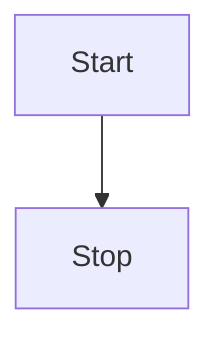

## 原生JS实现双向绑定

### html
```html
    <div>
      <label>Name:</label>
      <input type="text" data-model="name"/>
      <span data-binding="name" style="margin-left: 1rem;"></span>
    </div>

    <div>
      <label>Lastname:</label>
      <input type="text" data-model="lastName"/>
      <span data-binding="lastName" style="margin-left: 1rem;"></span>
    </div>

    <div>
      <label>Age:</label>
      <input type="text" data-model="age"/>
      <span data-binding="age" style="margin-left: 1rem;"></span>
    </div>
```

### js

```javascript
const createState = (stateObj) => {
  return new Proxy(stateObj, {
    set(target, property, value) {
      target[property] = value;
      render();
      return true;
    }
  });
};

const state = createState({
  name: '',
  lastName: '',
  age: null
});

const listeners = document.querySelectorAll('[data-model]');

listeners.forEach((element) => {
  const name = element.dataset.model;
  element.addEventListener('keyup', (event) => {
    state[name] = element.value;
    console.log(state);
  });
});

const render = () => {
  const bindings = Array.from(document.querySelectorAll('[data-binding]')).map(
    e => e.dataset.binding
  );
  bindings.forEach((binding) => {
    document.querySelector(`[data-binding=${binding}]`).innerHTML = state[binding];
    document.querySelector(`[data-model=${binding}]`).value = state[binding];
  })
}

```

## mvvm


