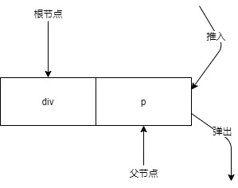
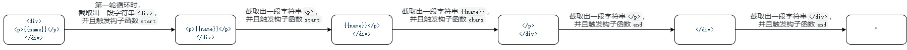

## 解析器

解析器内部包含开始标签钩子函数、结束标签钩子函数、文本钩子函数以及注释钩子函数。

伪代码：
```javascript
parseHTML(template, {
    start (tag/*标签名*/, attrs/*标签的属性*/, unary/*是否是自闭合标签*/) {
        // 每当解析到标签的开始位置时，触发该函数
    },
    end () {
        // 每当解析到标签的结束位置时，触发该函数
    },
    chars (text) {
        // 每当解析到文本时，触发该函数
    },
    comment (text) {
        // 每当解析到注释时，触发该函数
    }
})
```

比如：
```html
<div><p>foo</p></div>
```

上面模板解析时依次触发的钩子函数是：


层级关系栈：



## 运行原理

html模板：
```html
<div>
    <p>{{name}}</p>
</div>
```
